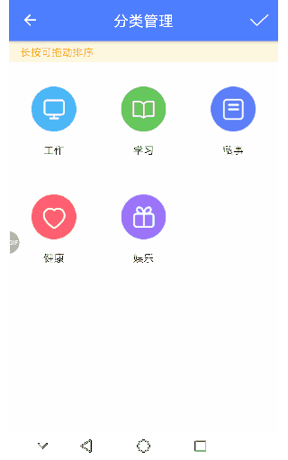
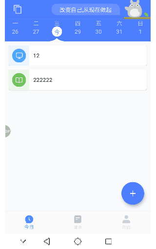
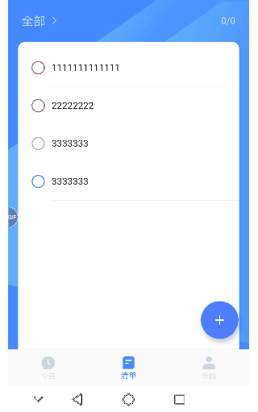
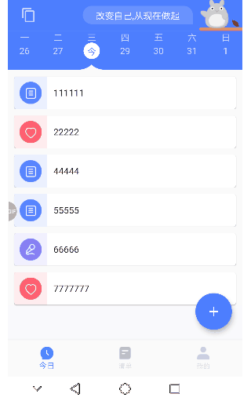
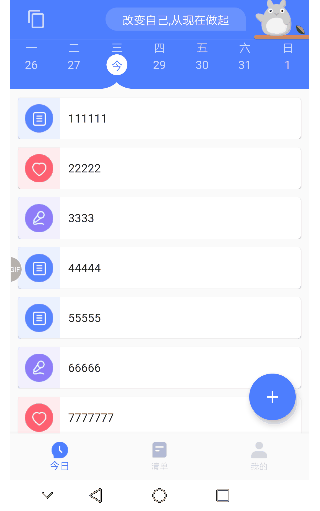

# 时光序_Flutter
时光序 Flutter 版是仿照Android版本的时光序，从开始自学dart到基本完成开发历时一个多月,项目中基本使用到了flutter大部分基础widget，完成了大部分炫酷的特效交互,项目使用flutter 官方推荐的provider进行状态管理.

基于dio网络请求库进行了二次封装可以很方便的进行请求与错误处理,使用 sqlite_orm（基于注解自动生成数据库实体bean） 库进行数据库的操作，封装了仿微信下拉显示和拖拽排序gridview等控件

**注意** ：后台使用的是香港服务器 有时可能出现超时情况 多试几次就好了

如果你觉得这个app不错，或者这个项目有帮助到你，不妨给这个项目一个Star吧 o(╥﹏╥)o

欢迎大家加入qq群 **290611780** 一起讨论 学习flutter
也欢迎大家发起 issue 或提交 PR ,

### 业务内容
主要包括以下内容：
- 注册、登录 
- 设置  清单添加、删除 
- 周视图 四象限 等等

### 安装包
[Android](https://www.pgyer.com/C9lo)

# 项目地址：
 > [https://github.com/kbz066/flutter_shiguangxu](https://github.com/kbz066/flutter_shiguangxu)
 ## 二维码：
 

### 效果图

||  | |
| --- | --- | --- |
|  | | |
|  |  | 

### 用到的主要开源库
- dio：网络请求
- flutter_spinkit：loading动画
- toast：吐司
- sqlite：数据库
- event_bus：事件总线
- datetime_picker_formfield：日期时间选择器
- provider ：状态管理
- image_picker ：图片选择

### 关于作者

Github &nbsp;&nbsp;&nbsp;&nbsp;&nbsp;: https://github.com/kbz066

